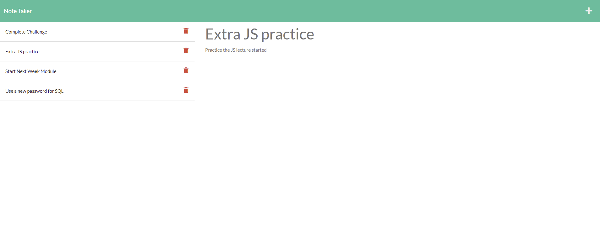

# Note Taker
  

  ## Description
  Simple note taker app. Cloud based.
  
  ## Link to the deployed app: https://arcane-bastion-63727.herokuapp.com/notes

## Table of contents
* [Installation](#installation)
* [Usage](#usage)
* [Credits](#credits)
* [License](#licence)
  

  ## Installation
  
  No installation required, just follow the link above to the deployed app to use.
  
  If you still want to install - to install all the files for the "Note Taker" app please clone this https://github.com/anaumov1/an-note-taker.git repository to your computer. For instructions on how to clone a repository from GitHub follow this link: https://docs.github.com/en/github/creating-cloning-and-archiving-repositories/cloning-a-repository.
This is a NODE.js based program - the user will need to install Node.js to the local terminal. Please refer to the Node.js website for instalation directions.

  
  ## Usage
  Once clicked on the link please wait a few swconds for the app to load, the "Note Taker" app is on a free cloud and it takes a little longer to load. The link will take you to the main interface. Type the note you need, bellow type detailes regarding the note and click on the save icon on the top right. !!! Important - both fields have to be completed in order for the save icon to display.
  You can delete old notes by clicking on the trash bin icon next to it.
  
  

  ## License
  This project is s licensed under the [MIT](LICENSE)
    
  ## Contributing
  I apreciate the help and contributions, please cdontact repository owner before contributing. Lets make this app better.

  ## Tests
 
  No test available for this app at the moment.
